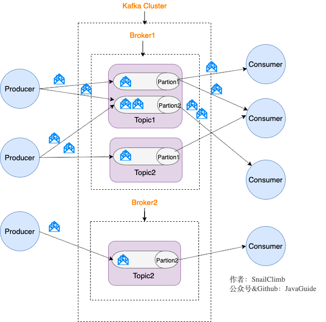
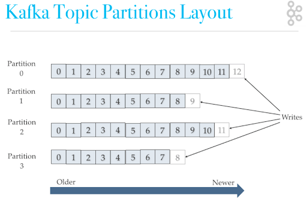

# Kafka

## 消息系统分类

### Peer-to-Peer(Queue)

PTP队列模式，点到点的模式。

**工作模式**
1. 消息生产者生产消息进入队列，消费者从队列中取出消息并进行消费
2. 一条消息只能被一个消费者消费，消费过后消息从队列中移除，其他消费者不能再消费
3. 一个队列支持多个生产者写入
4. 消息如果没有被消费，那么就会一直存在在队列中，可以不存在消费者

### Publish/Subscribe(Topic)
发布-订阅模式。
> Kafka所采用的就是发布-订阅模式，被称为一种高吞吐量、持久性、分布式的发布订阅的消息队列系统

在一条消息已经被Producer发送到Topic后才订阅的Consumer是不能消费到这条消息的

**工作模式**
1. 生产者发布消息到Topic中，同时有多个消费者来消费消息
2. 发布到Topic中的消息会被多个消费者订阅消费
3. 当生产者发布消息的时候，无论是否存在消费者都不会报错
4. 一定是现有生产者再有消费者

## 核心API
- Producer API: 生产者API允许一组应用将一组记录发布到一个或者多个Kafka Topic中
- Consumer API: 消费者API允许应用程序订阅一个或者多个Topic，并处理向它们传输的数据流
- Streams API: 流API允许应用程序充当流处理器，从一个或者多个Topic中消费输入流，并将输出流生成为一个或多个输出主题，从而将输入流有效地转换为输出流
- Connector API: 连接器API允许构建和运行可重用的生产者或消费者，这些生产者或消费者将Kafka Topic连接到现有的应用程序或数据系统

## Kafka的架构组成

- Producer: 消息和数据的生产者，主要负责生产PUSH消息到Broker的Topic中
- Broker: Kafka节点就是被称为Broker，Broker主要负责创建Topic，存储Producer所发布的消息，记录消息处理的过程，现是将消息保存到内存中，然后持久化到磁盘
- Topic: 同一个Topic的消息可以分布在一个或多个Broker上，一个Topic包含一个或者多个Partition分区，数据被存储在多个Partition中
- Partition: 分区；在这里被称为Topic物理上的分组，一个Topic在Broker中被分为1个或者多个Partition
  ，也可以说为每个Topic包含一个或多个Partition，(一般为kafka节点数为CPU的总核心数量)
  分区在创建Topic的时候可以指定。分区才是真正存储数据的单元，每个Partition中会区分Leader和Followers，Leader
  负责该Partition的所有读写操作
- Consumer: 消息和数据的消费者，主要负责主动到已订阅的Topic中拉取消息并消费，Kafka的消费者是采用PULL模式来从对应的Topic
  中拉取数据，而不是像Producer一样去PUSH数据，原因在于Broker并不知道Consumer消费数据的速度，采取PULL
  模式的时候，消费者可以基于自己的消费速率来决定拉取速率，每一次消费完成之后再去消费下一批消息
- replication-factor: 复制因子，如果在创建Topic时将此值设置为1的话，代表整个Topic在Kafka中只有一份，该复制因子数量建议与Broker节点数量一致

## 多副本机制
Kafka在分区中引入了多副本机制。Partition中的多个副本里会有一个Leader，其他的都是Followers，发送的消息都会发送到Leader
副本中，其他的Followers会从Leader中同步拉取数据。
> 在Kafka中，Producer和Consumer只和Partition中的Leader副本交互，Followers副本都是Leader
> 副本的拷贝，是为了保证消息存储的安全性而存在，当Leader副本出现问题的时候，会从同步程度高的Followers副本中选取一个作为新的Leader副本

**Kafka多分区多副本机制的好处**
1. Kafka通过给Topic指定Partition分区，同一个Topic的不同Partition可以存在于不同的Broker
   上，提供了比较好的并发能力（负载均衡）
2. 通过给Partition引入多副本机制，极大的提高了消息存储的安全性，提高了容灾能力，但同时也增加了相应所需要的存储空间

## Kafka如何保证消息的消费顺序 {id="kafka_1"}

1. 一个Topic只对应一个Partition【负载均衡能力降低】
2. 发送消息的时候指定key(Partition)

在Kafka中，Partition是真正保存消息的位置。

每次添加消息的时候都是采用尾加法，由于一个Topic可以拥有多个Partition，所以Kafka只能保证消息在一个Partition
中的有序，而不能保证Topic中的Partition的顺序。

消息在加入到Partition的时候会有一个offset偏移量，Kafka通过偏移量来保证消息在Partition中的顺序。

Kafka在发送消息的时候可以指定Topic、Partition、Key、Data四个参数，同一个Key的参数会被发送到同一个Topic
中，指定了Partition的消息会被发送到对应的Partition中

## Kafka如何保证消息不丢失 {id="kafka_2"}
### 生产者丢失消息
Producer调用send方法发消息的时候可能会由于网络原因发送失败，所以不能默认是发送成功的，
由于发送是一个异步操作所以可以等待获取发送结果或者回调函数的方式来获取到发送结果。

1. 调用send方法之后使用`get()`来等待获取发送结果，但这种时候就将异步操作变成了同步操作
2. 调用send方法之后会返回一个`Feature`对象，可以注册一个回调函数对结果进行处理
3. 【推荐】Producer会有一个`retries`参数，设置之后如果由于网络原因导致消息发送失败，可以自动重试`retries
   `次，在使用这个参数的时候需要将重试间隔的时间也相应调大

### 消费者丢失消息
当Consumer在消费Partition的数据的时候，会被分配一个offset（偏移量）来标识消费的位置，默认情况下Consumer
拉取到消息之后就会自动提交这个offset，表示自己已经消费过这个消息了，但是如果还没有来得及对消息进行处理Consumer
就挂掉了，就会导致这条消息还没有真正的被处理，所以我们可以关闭Kafka的Consumer自动提交的能力，改为手动提交，消息处理完之后再提交offset
，但这种模式可能会导致重复消费，所以这样处理的时候要保证幂等性

Kafka中Consumer也支持重置offset，可以将offset进行回拨修改

### Kafka自身弄丢了消息 {id="kafka_3"}
由于Kafka在Partition中引入了多副本机制，我们所有的读写操作都是在Leader副本上，其他Followers副本同步拷贝Leader
副本的内容，如果Leader副本挂掉，此时Followers副本会被选举成为新的Leader，如果有消息没有拷贝，就会造成消息的丢失
- acks: acks是Kafka中Producer的参数，默认是1，表示只要Leader副本收到了消息就认为消息发送成功，如果设置成all
  ，就要求所有的副本都收到了消息后才认为是消息发送成功
- replication.factor: 该参数表示某个Topic中每个Partition的副本数，设置该参数大于等于3，保证每个Partition
  至少有3个副本，保证数据的安全性
- min.insync.replicas: 表示消息写入多少个副本才算成功发送，默认是1，也就是写入了一个副本之后就认为发送成功了，尽量设置大于1的值
- unclean.leader.election.enable: 当我们配置了 unclean.leader.election.enable = false 的话，
当 leader 副本发生故障时就不会从 follower 副本中和 leader 同步程度达不到要求的副本中选择出 leader ，这样降低了消息丢失的可能性

> min.insync.replicas需要小于replication.
> factor，如果两者相等，那么只要有一个副本发生问题就会导致整个Partition无法正常工作，对高可用性的影响很大

