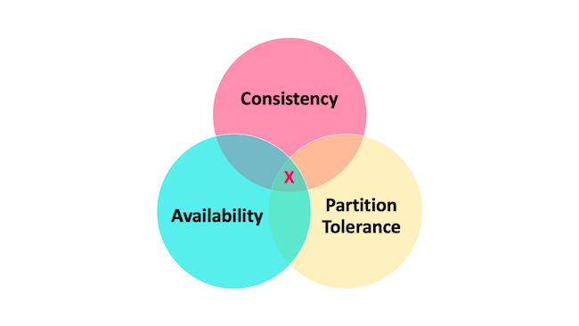
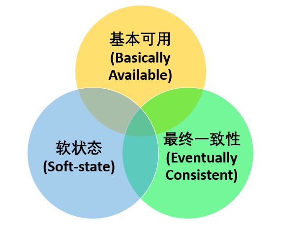

# 分布式事务

> ACID 是数据库事务完整性的理论，CAP 是分布式系统设计理论，BASE 是 CAP 理论中 AP 方案的延伸。

## CAP理论

- Consistency：一致性，所有节点访问同一份最新的数据副本
- Availability: 可用性，非故障节点在合理的时间内返回合理的响应（不是错误或者超时响应）
- Partition Tolerance: 分区容错性，分布式系统出现网络分区时，仍然可以对外提供网络服务
> 网络分区：分布式系统中，多个节点之前的网络本来是连通的，但由于发生了某些故障，某些节点之间连不通了，整个网络就分成了几块区域，即发生了网络分区

> 在网络分区发生的情况下，我们如果要继续服务，那么强一致性和可用性就只能2选一。也就是说当网络分区发生的情况下，P是前提，在决定了P之后才需要考虑A
> 和C的取舍，也就是说在分布式系统中，分区容错性是必须要保证的，如果系统没有发生分区，那么也就不存在分区容错性，此时一致性和可用性是可以同时保证的

**在决定了P之后，CA无法同时实现**
如果系统发生和分区，系统中某个节点发生了写操作，如果要保证C（一致性），那么就需要禁止其他节点的读写，此时就违背了A（可用性）；如果要保证A
（可用性），那么其他节点读写就是正常的，这种情况下数据就会有不一致的情况，也就违背了C（一致性）

## BASE理论
> 即使无法做到强一致性，但每个应用可以根据自己的业务特点，采用适当的方式来使系统达到最终一致性，也就是牺牲数据的一致性来满足系统的高可用性，系统中一部分数据不可用或者不一致时，仍需要保持系统整体“主要可用”。

- Basically Available: 基本可用是指分布式系统在出现不可预知故障的时候，允许损失部分可用性。但是，这绝不等价于系统不可用。
  - 响应时间上的损失：当系统发生故障的时候，允许处理请求时间变长
  - 系统功能上的损失：当系统流量激增的时候，非核心业务功能可以无法使用
- Soft State: 软状态，允许系统中数据存在中间状态（CAP
  理论中的数据不一致），并认为该中间态的数据不会影响系统的整体可用性，即允许系统在不同的副本之间的数据同步存在延迟
- Eventually Consistent: 最终一致性，强调的是系统中所有的数据副本，在经过一段时间的同步后，最终能够达到一个一致的状态。 因此，最终一致性的本质是需要系统保证最终数据能够达到一致，而不需要实时保证系统数据的强一致性。

> - 强一致性 ：系统写入了什么，读出来的就是什么。 
> - 弱一致性 ：不一定可以读取到最新写入的值，也不保证多少时间之后读取到的数据是最新的，只是会尽量保证某个时刻达到数据一致的状态。 
> - 最终一致性 ：弱一致性的升级版，系统会保证在一定时间内达到数据一致的状态，

### 最终一致性的实现
- 读时修复：在读取数据的时候，检测数据的不一致，进行修复
- 写时修复：在写入数据的时候，如果数据不一致，进行修复
- 异步修复：通过定时检查数据，将不一致的数据进行修复

## Gossip协议
**不同节点之间进行信息/数据共享**

> Gossip协议是一种允许在分布式系统中共享状态的去中心化通信协议，通过这种通信协议，我们可以将信息传播给网络或集群中的所有成员

### 消息传播模式
> - 反熵会传播节点上的所有数据，而谣言传播只传播新的数据
> - 我们一般会给反熵设计一个闭环
> - 谣言传播适合节点数目比较多或者节点动态变化的场景
#### 反熵（Anti-entropy）
- 推方式：将自己的所有副本数据推送给对方，降低对方的熵
- 拉方式：自己拉取其他副本的数据来修复降低自己的熵
- 推拉方式：同时修复自己和对方的熵

在我们实际应用场景中，一般不会采用随机的节点进行反熵，而是需要可以的设计一个闭环。这样的话，我们能够在一个确定的时间范围内实现各个节点数据的最终一致性

#### 谣言传播（Rumor mongering）
谣言传播指的是分布式系统中一个节点一旦有了新的数据之后，就会变成活跃节点，活跃节点会周期性的联系其他节点向其发送新的数据，直到所有节点都存储了新的数据

### 优势与缺陷
#### 优势
- 简单，相比于其他分布式协议来说，Gossip协议理解起来非常简单
- 能够容忍网络上节点的随意地增加或者减少，宕机或者重启，因为 Gossip 协议下这些节点都是平等的，去中心化的。新增加或者重启的节点在理想情况下最终是一定会和其他节点的状态达到一致
- 速度相对较快。节点数量比较多的情况下，扩散速度比一个主节点向其他节点传播信息要更快（多播）

#### 缺陷
- 消息需要通过多个传播的轮次才能传播到整个网络中，因此，必然会出现各节点状态不一致的情况。毕竟，Gossip 协议强调的是最终一致，至于达到各个节点的状态一致需要多长时间，谁也无从得知
- 由于拜占庭将军问题，不允许存在恶意节点
- 可能会出现消息冗余的问题。由于消息传播的随机性，同一个节点可能会重复收到相同的消息